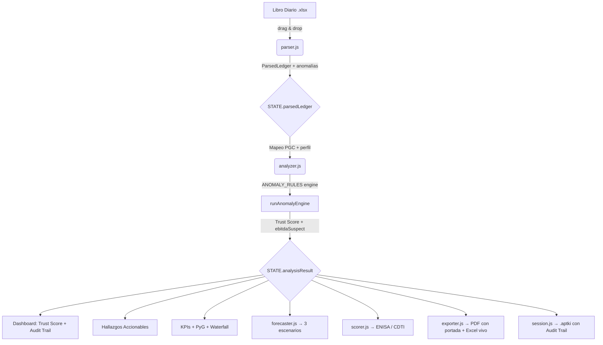

# Arquitectura de APTKI Workstation

Guía de flujo de datos y estructura interna. El estado central vive en `STATE` (app.js) y se transforma capa por capa. Ningún paso modifica destructivamente los datos del paso anterior.

## Flujo de Datos

## Módulos

### parser.js — Ingesta
- Lee Excel vía SheetJS, normaliza columnas, extrae asientos
- Detecta anomalías de nivel 1 (descuadres, cuentas 129, variaciones bruscas)
- **Output:** `ParsedLedger` → `{ meta, entries, byMonth, anomalies }`

### analyzer.js — Motor Analítico
- Convierte cuentas PGC en modelo de negocio (Ventas, COGS, Personal)
- Motor de devengo (Accruals Engine) para normalizar EBITDA
- **Motor de Reglas Declarativo** (`ANOMALY_RULES`) — 7 reglas independientes
- Calcula **Trust Score** (0–100) y flag **ebitdaSuspect**
- **Output:** `AnalysisResult` → ver `DATA_CONTRACT.md`

### profiles.js — Perfiles Sectoriales
- Definición de perfiles (SaaS, Industrial, Servicios, Genérico)
- KPIs universales + KPIs específicos por sector
- Funciones de utilidad: `getKpiStatus`, `formatKpiValue`, `getStatusIcon`

### app.js — Controlador SPA
- Navegación entre secciones, gestión de `STATE`
- `logAudit()` — Registro de eventos del pipeline
- Renderizado: Trust Score, Audit Trail, Hallazgos Accionables, KPIs, PyG, Waterfall
- Biblioteca de reglas visible (`renderRulesLibrary`)
- Bloqueo de dashboard si hay anomalías críticas

### Módulos Satélite
| Módulo | Responsabilidad |
|--------|----------------|
| `forecaster.js` | Proyección 12M (base/optimista/pesimista) |
| `scorer.js` | Scoring ENISA + CDTI con inputs mixtos |
| `narrative.js` | Texto analítico automático |
| `checklist.js` | Filtro Día 1 con auto-completado |
| `knowledge.js` | Guía de financiación |
| `exporter.js` | PDF (portada + dashboard) + Excel (fórmulas vivas) |
| `session.js` | Persistencia .aptki con Audit Trail |

## Reglas Arquitectónicas

1. **Inmutabilidad** — `analyzer.js` nunca muta `ParsedLedger`. Siempre devuelve objetos nuevos.
2. **Separación DOM/Lógica** — `parser.js` y `analyzer.js` son librerías puras sin conocimiento del HTML.
3. **Local-First** — Todo ocurre en el navegador. Confidencialidad nivel bancario.
4. **Contrato de datos** — Todos los consumidores de `AnalysisResult` deben respetar `DATA_CONTRACT.md`.
5. **Reglas extensibles** — Añadir una regla = pushear un objeto a `ANOMALY_RULES`. Sin tocar el motor.
