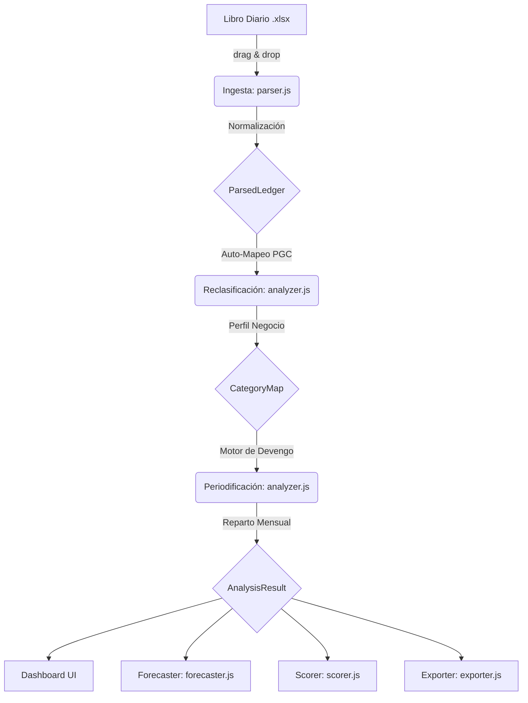

# Arquitectura de APTKI Workstation

Esta guía describe el flujo de datos y la estructura interna de la aplicación, garantizando que el mantenimiento y la escalabilidad del sistema se mantengan bajo los estándares de las "Buenísimas Prácticas" de Antigravity.

## Flujo de Datos (Data Flow)

El sistema funciona de forma secuencial e inmutable. El estado central vive en la variable global `STATE` (en `app.js`) y se transforma capa por capa. Ningún paso modifica destructivamente los datos del paso anterior.

### 1. Ingesta y Parseo (`parser.js`)
*   **Misión:** Leer el Excel en crudo mediante `SheetJS`, limpiar y estandarizar las columnas (ignorar tildes, mayúsculas) y extraer las transacciones (Debe, Haber, Cuentas).
*   **Output:** Genera el objeto inmutable `ParsedLedger` que contiene un listado limpio de `entries` (asientos) agrupados por mes (`byMonth`).

### 2. Motor Analítico y Devengo (`analyzer.js`)
*   **Misión:** Convertir los asientos PGC (600, 705) en un modelo de negocio (Ventas, COGS, Personal). Calcula EBITDA, márgenes y detecta pagos anuales para sugerir su prorrateo (Devengo/Accruals).
*   **Output:** Genera el objeto `AnalysisResult`, que incluye la PyG mensual (`pygMensual`), totales agregados, métricas de *burn rate* y el saldo de tesorería (`balance`).

### 3. Módulos Satélite
Todos estos módulos consumen el `AnalysisResult` en modo de solo lectura para proyectar información visual o estratégica:
*   **`forecaster.js`:** Aplica hipótesis paramétricas (crecimiento, churn) sobre la media del baseline (últimos 3 meses) para proyectar 12 meses de caja en escenarios base, optimista y pesimista.
*   **`scorer.js`:** Cruza la contabilidad con metadatos introducidos manualmente para calcular elegibilidad de ENISA (1:1 deuda/patrimonio, edad) y CDTI Neotec.
*   **`checklist.js` & `knowledge.js`:** Herramientas internas del consultor para asegurar la calidad de la auditoría.
*   **`session.js`:** Exporta el objeto global `STATE` a un archivo local `.aptki` e importa sesiones previas, logrando un persistencia local sin servidor.
*   **`exporter.js`:** Transforma los resultados financieros de la memoria a un archivo descargable de Excel vivo (con fórmulas PGC), o a un informe PDF Ejecutivo vía DOM.

## Reglas de Mantenimiento Arquitectónico
1.  **Inmutabilidad:** Las funciones de `analyzer.js` jamás deben mutar el `ParsedLedger`. Siempre devuelven nuevos objetos o clonan arrays para los cálculos de devengo.
2.  **Segregación de Responsabilidades:** La manipulación del DOM se restringe a `app.js` (o a los `renderX()` de cada submódulo). `parser.js` y `analyzer.js` son librerías matemáticas puras sin conocimiento del HTML.
3.  **Local-First:** Todo ocurre en el navegador del usuario para asegurar confidencialidad nivel bancario.
