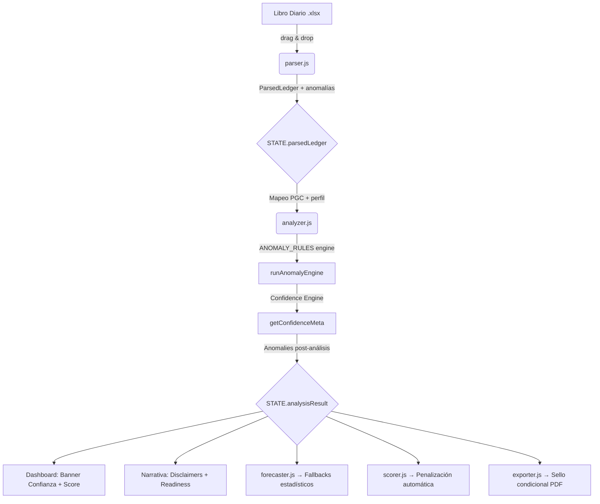

# Arquitectura de APTKI Workstation

Guía de flujo de datos y estructura interna. El estado central vive en `STATE` (app.js) y se transforma capa por capa. Ningún paso modifica destructivamente los datos del paso anterior.

## Flujo de Datos

## Módulos

### parser.js — Ingesta
- Lee Excel vía SheetJS, normaliza columnas, extrae asientos
- Detecta anomalías de nivel 1 (descuadres, cuentas 129, variaciones bruscas)
- **Output:** `ParsedLedger` → `{ meta, entries, byMonth, anomalies }`

### analyzer.js — Motor Analítico
- Convierte cuentas PGC en modelo de negocio (Ventas, COGS, Personal)
- Motor de devengo (Accruals Engine) para normalizar EBITDA
- **Motor de Reglas Declarativo** (`ANOMALY_RULES`) — 7 reglas independientes
- **Confidence Engine** (`getConfidenceMeta`) — Centraliza la lógica de fiabilidad:
  - Calcula `trustScore` y `confidenceLevel`.
  - Determina `forecastMode` (fallbacks estadísticos).
  - Calcula `scoringPenalty` para ENISA/CDTI.
  - Genera `fundingReadinessFlags`.
- **Output:** `AnalysisResult` → ver `DATA_CONTRACT.md`

### app.js — Controlador SPA
- Navegación entre secciones, gestión de `STATE`
- `logAudit()` — Registro de eventos del pipeline
- Renderizado: Banner de Confianza, Trust Score, Audit Trail, Hallazgos (con efecto en financiación)
- Bloqueo visual del dashboard si la confianza es baja (Watermark)

## Reglas Arquitectónicas

1. **Inmutabilidad Estricta** — `analyzer.js` nunca muta `ParsedLedger.anomalies`. Las anomalías del análisis se combinan en un nuevo array en `AnalysisResult`.
2. **Propagación de Confianza** — Ningún módulo (forecast, scoring, narrative) debe calcular su propia fiabilidad. Todos deben consumir el bloque `confidence` del `AnalysisResult`.
3. **Separación DOM/Lógica** — `parser.js` y `analyzer.js` son librerías puras.
4. **Local-First** — Todo ocurre en el navegador. Confidencialidad nivel bancario.
5. **Fallbacks Estadísticos** — El sistema debe degradar su precisión (ej. mediana en lugar de promedio) si la confianza del dato es baja, informando siempre al consultor.
## Notas de Evolución

- **Deduplicación de Anomalías:** Actualmente se realiza por `id` único. Para futuras versiones con libros multi-año o multi-instancia, se debe evolucionar a un esquema de `id + contexto` (ej. `id + mes` o `id + cuenta`) para evitar una deduplicación excesivamente agresiva que oculte recurrencias legítimas.
- **Trazabilidad:** Se mantiene el `id` estable en todo el pipeline para asegurar que la UI (`app.js`) y los exportadores puedan mapear hallazgos técnicos a recomendaciones de negocio sin dependencias de texto.
